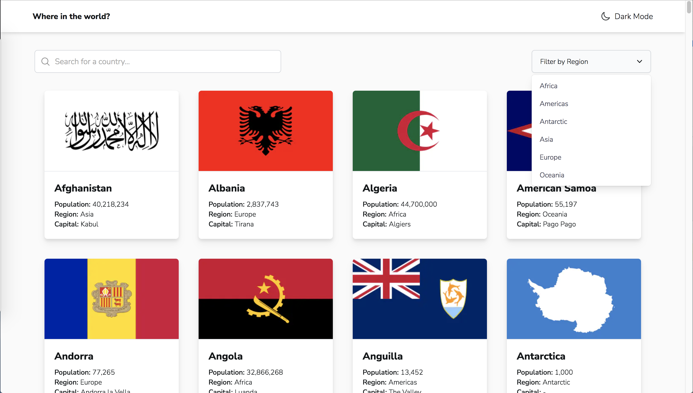
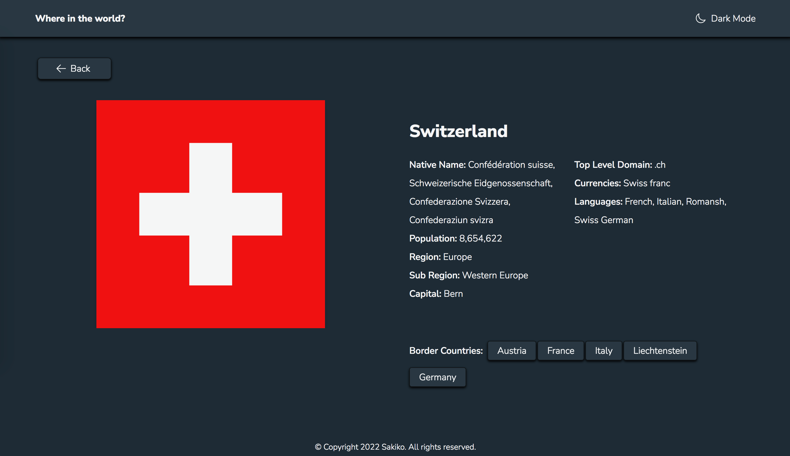
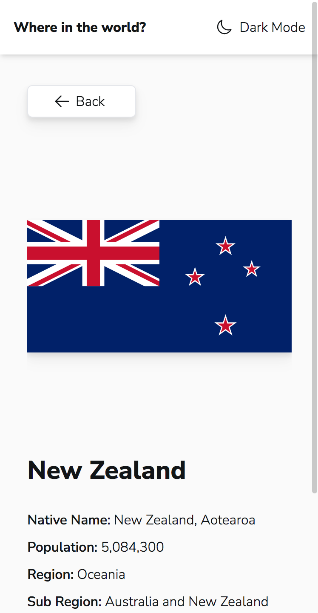
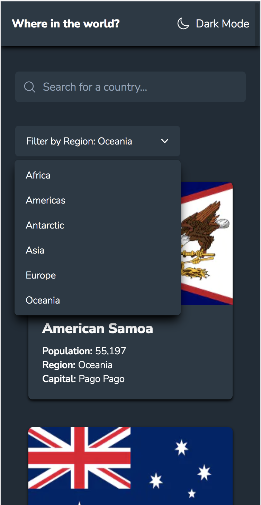

# Country Search - Next.js

## Screenshots

  <h3>Desktop</h3>
  
  

 

  <h3>Mobile</h3>
  
  

 

## Built with

- [Next.js](https://github.com/vercel/next.js/) - React based framework with
  server-side rendering
- [create-next-app](https://github.com/vercel/next.js/tree/canary/packages/create-next-app) -
  CLI tool for Next.js
- [Tailwind CSS](https://github.com/tailwindlabs/tailwindcss) - Utility-first
  CSS framework
- [Heroicons](https://github.com/tailwindlabs/heroicons) - SVG icons
- [Headless UI](https://github.com/tailwindlabs/headlessui) - UI component
- [styled-components](https://github.com/styled-components/styled-components) -
  CSS-in-JS framework
- [SWR](https://github.com/vercel/swr) - React Hooks library for data fetching
- [REST Countries](https://restcountries.com/) - Countries data API
- [Frontend Mentor - REST Countries API with color theme switcher](https://github.com/frontendmentorio/rest-countries-api-with-color-theme-switcher) -
  App idea, design
